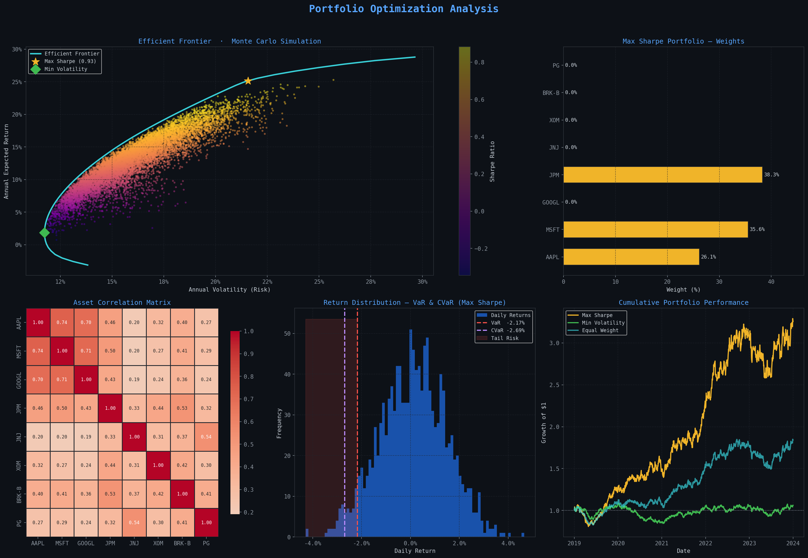

# 📈 Portfolio Optimization Model
### Markowitz Mean-Variance Framework with Actuarial Risk Measures



---

## 📌 Overview

This project builds a **portfolio optimization model** using Modern Portfolio Theory (MPT),
developed as part of my actuarial science studies. Given a set of stocks, the model finds
the optimal way to allocate investment capital to maximize return for a given level of risk.

The project combines **quantitative finance** (Markowitz framework) with **actuarial risk measures**
(Value at Risk and Conditional Value at Risk) — tools used by insurance companies, pension funds,
and investment banks to manage financial risk.

---

## 🎯 Key Questions Answered

- What is the best combination of stocks to maximize risk-adjusted return?
- How does the Efficient Frontier define the boundary of optimal portfolios?
- What is the worst-case daily loss (VaR) and expected loss in bad scenarios (CVaR)?
- How do different portfolio strategies compare over time?

---

## 📊 Results

| Portfolio | Annual Return | Volatility | Sharpe Ratio | Daily VaR (95%) | Daily CVaR (95%) |
|---|---|---|---|---|---|
| Max Sharpe | 37.8% | 32.2% | 1.02 | -2.75% | -4.25% |
| Min Volatility | ~9% | ~20% | — | -1.48% | -2.53% |
| Equal Weight | ~20% | ~25% | — | -1.77% | -3.09% |

---

## 🛠️ Methods Used

### 1. Data Collection
- 5 years of daily stock price data (2019–2024) pulled using `yfinance`
- 8 stocks across diverse sectors: Technology, Banking, Healthcare, Energy, Consumer Goods

### 2. Return & Risk Calculations
- Daily returns computed as percentage price changes
- Annualised return = daily mean × 252 trading days
- Annualised volatility = daily standard deviation × √252
- Covariance matrix to capture relationships between assets

### 3. Monte Carlo Simulation
- 10,000 random portfolio weight combinations generated
- Each portfolio plotted by risk vs return to form the investment opportunity set
- Sharpe Ratio calculated for each: `(Return - Risk Free Rate) / Volatility`

### 4. Mathematical Optimisation
- `scipy.optimize` used to find exact optimal portfolios
- **Max Sharpe Portfolio** — highest return per unit of risk
- **Min Volatility Portfolio** — lowest possible risk
- **Efficient Frontier** — traced by optimising at each return target level

### 5. Actuarial Risk Measures
- **VaR (Value at Risk)** — maximum expected loss at 95% confidence
- **CVaR (Conditional VaR / Expected Shortfall)** — average loss beyond the VaR threshold
- Applied to all three portfolio strategies for comparison

---

## 📉 Charts Produced

| Chart | Description |
|---|---|
| Efficient Frontier | 10,000 Monte Carlo portfolios + optimal frontier curve |
| Portfolio Weights | Asset allocation of the Max Sharpe portfolio |
| Correlation Heatmap | Pairwise correlations between all 8 assets |
| Return Distribution | Histogram with VaR and CVaR marked |
| Cumulative Performance | Growth of $1 invested in each strategy (2019–2024) |

---

## 🧰 Technologies Used

```
Python 3.12
├── yfinance       — stock price data
├── pandas         — data manipulation
├── numpy          — matrix operations & simulation
├── matplotlib     — charts and visualisation
├── seaborn        — correlation heatmap
└── scipy          — mathematical optimisation
```

---

## 🚀 How to Run

**1. Clone this repository**
```bash
git clone https://github.com/mandy-analytics/portfolio-optimization.git
cd portfolio-optimization
```

**2. Install dependencies**
```bash
pip install yfinance pandas numpy matplotlib seaborn scipy
```

**3. Run the model**
```bash
python portfolio_optimization.py
```

---

## 📚 References

- Markowitz, H. (1952). *Portfolio Selection*. Journal of Finance.
- Rockafellar, R. & Uryasev, S. (2000). *Optimization of Conditional Value-at-Risk*.
- Hull, J. (2018). *Options, Futures, and Other Derivatives*. Pearson.

---

## 👩🏾‍💻 Author

**Mandy Fafa Magbo** — Actuarial Science Student  
📧 amandamagbo12@gmail.com  
🔗 [LinkedIn](https://linkedin.com/in/mandy-magbo)  
🐙 [GitHub](https://github.com/mandy-analytics)

---

*This project was built for educational purposes and as part of my actuarial science portfolio.*
